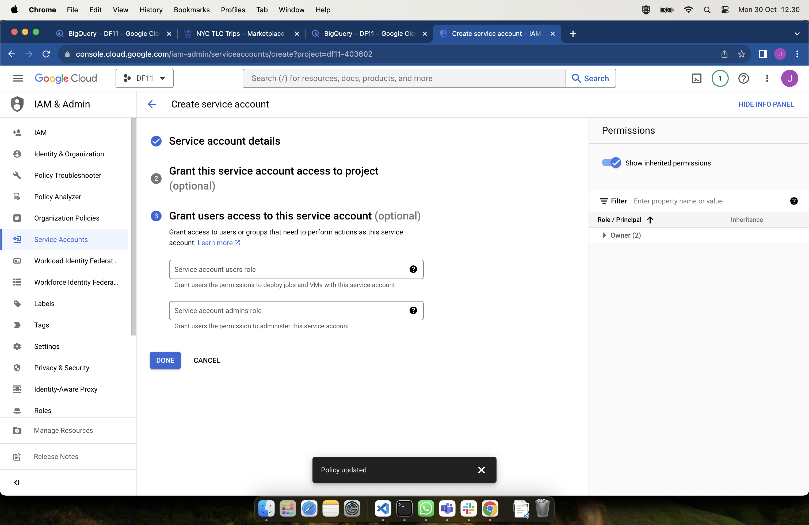
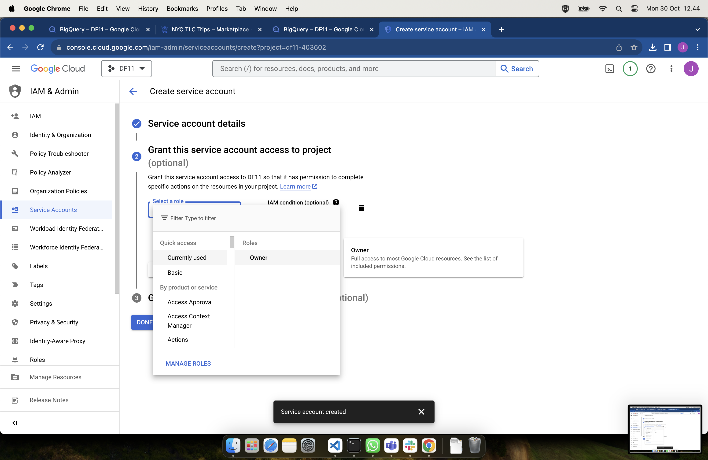
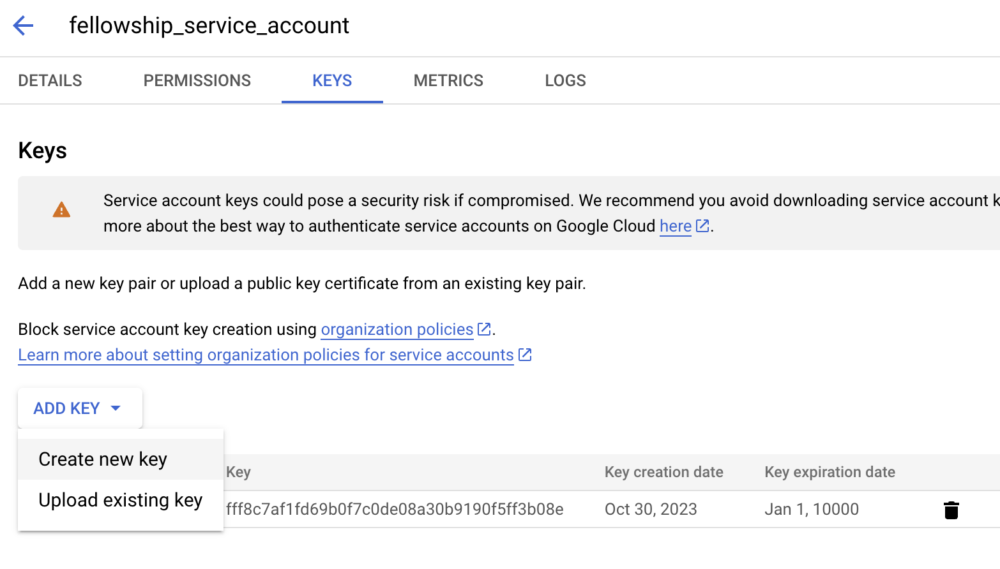
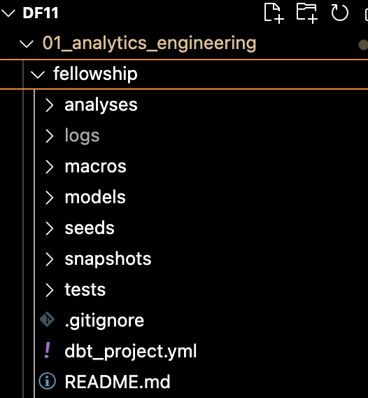

```sh 
dbt init fellowship
```

```sh
Happy modeling!

04:27:49  Setting up your profile.
Which database would you like to use?
[1] bigquery

(Don't see the one you want? https://docs.getdbt.com/docs/available-adapters)

Enter a number: 1
```

### Generate Auth in GCP






```sh
Enter a number: 1
[1] oauth
[2] service_account
Desired authentication method option (enter a number): 2
```

```sh
keyfile (/path/to/bigquery/keyfile.json): /Users/primasatyareza/Workspace/Iykra/DF11/DF11/df11-403602-fff8c7af1fd6.json
```
*** Put file in root of directory

```sh
project (GCP project id): df11-403602
```

```sh
dataset (the name of your dbt dataset): fellowship11   
```

```sh
threads (1 or more): 3
```

```sh
job_execution_timeout_seconds [300]: (enter)
```

```sh
[1] US
[2] EU
Desired location option (enter a number): 1
```

After done will create directory like this:


```sh
cd fellowship
run "dbt debug"
```