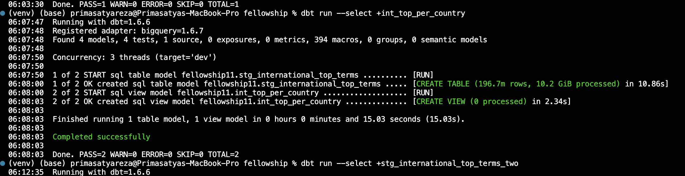
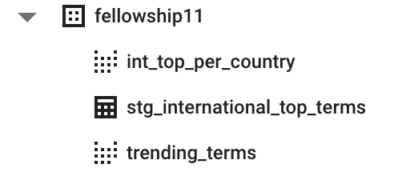
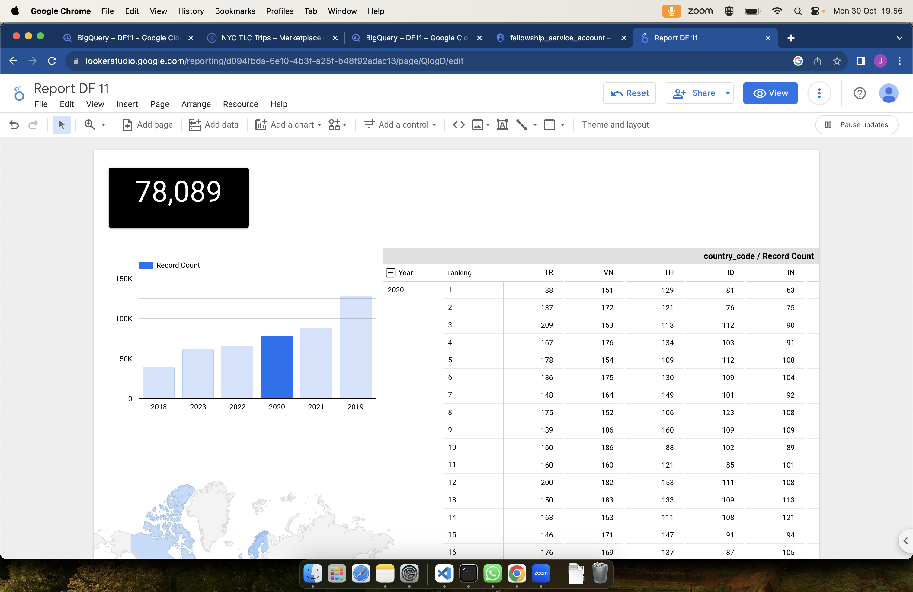

# Let's Play

## Models,

- Create 3 folder under models
    - Staging
        ```sh
            mkdir staging
        ```
    - Intermediate
        ```sh
            mkdir intermediate
        ```
    - Marts
        ```sh
            mkdir marts
        ```
        


### Staging

The staging model is a model that:

- taking raw data into views
- apply some type casting from raw data
- renaming field
- deduplicate data

Under staging folder create :
    - create 
        ```sh
        touch _model.yml 
        ```
    - create 
        ```sh
        touch _src_.yml 
        ```

_model.yml is the file to populate model definition
```yaml
version: 2

models:
  - name: stg_international_top_terms
  - name: stg_international_top_terms_two
```
_src.yml is the file to populate source data 
```yaml
version: 2
sources:
  - name: s_google_trends
    database: bigquery-public-data
    schema: google_trends
    tables:
      - name: s_international_top_terms
        identifier: international_top_terms
```

Create file stg_international_top_terms.sql as the main of query
```sh
    touch stg_international_top_terms.sql
```

Inside of the file stg_international_top_terms.sql, write query like this:
```sql
with source as (

    select * from {{ source('s_google_trends', 's_international_top_terms') }}

),

base as (

    select
        cast( week as date ) as week_start_date,
        cast( country_code as string ) as country_code,
        lower( cast( region_name as string ) ) as region_name,
        lower( cast( term as string ) ) as search_term,
        cast( score as numeric ) as score,
        cast( rank as numeric ) as ranking

    from source
    -- where week > '2021-12-31'

)

select * from base
```

Try also that query on BiqQuery.

To check written the query :
```sh
dbt run --select +stg_international_top_terms  
```

The model created will show on the logs message:


let’s see on the BQ, we can see the currently created view table.



### Intermediate
create file under intermediate folder int_top_per_country.sql

write the script
```sql
with s_itop_terms as (

    select * from {{ ref('stg_international_top_terms') }}

),

ordered_terms_by_rank_and_score as (

  select
    week_start_date,
    country_code,
    region_name,
    score,
    ranking,
    search_term
  from s_itop_terms
  -- where week_start_date >= '2022-01-01'
    where score is not null
    and ranking is not null
  order by week_start_date,
           country_code,
           ranking asc,
           score desc,
           region_name

),

max_scores_per_rank as (

  select
    week_start_date,
    country_code,
    ranking,
    max(score) as max_score,
  from
    ordered_terms_by_rank_and_score
  group by week_start_date, country_code, ranking
  order by week_start_date, country_code, ranking

),

base as (

  select
    mx.week_start_date as week_start_date,
    mx.country_code as country_code,
    mx.ranking as ranking,
    oirs.search_term as search_term,
    max(mx.max_score) as max_score
  from ordered_terms_by_rank_and_score oirs
  inner join max_scores_per_rank mx on mx.ranking = oirs.ranking
                                and mx.max_score = oirs.score
                                and mx.country_code = oirs.country_code
                                and mx.week_start_date = oirs.week_start_date
  group by mx.week_start_date, mx.country_code, oirs.search_term, mx.ranking
  order by mx.week_start_date, mx.country_code, mx.ranking

)

select * from base
```

### Marts
```sql
with source as (

    select * from {{ ref('int_top_per_country') }}

),

final as (

    select

        week_start_date,
        country_code,
        ranking,
        search_term,
        max_score as score

    from
        source

)

select * from final
```

### Lets try with target Schema


## Documentation
- dbt provides a way to generate documentation for a dbt project and render it as a website.
- we can write documentation about tables in the schema.yml file.
- if you are using dbt locally, you can generate a documentation through this command:

```sh
dbt docs generate
dbt docs serve
dbt build
```

# Visualizing the transformed data in Looker Studio
To visualize Marts model data in Looker Studio (previously known as Google Data Studio).
Create a data source, choose BigQuery, select tending_terms table, then click connect now.
Make your chart!

